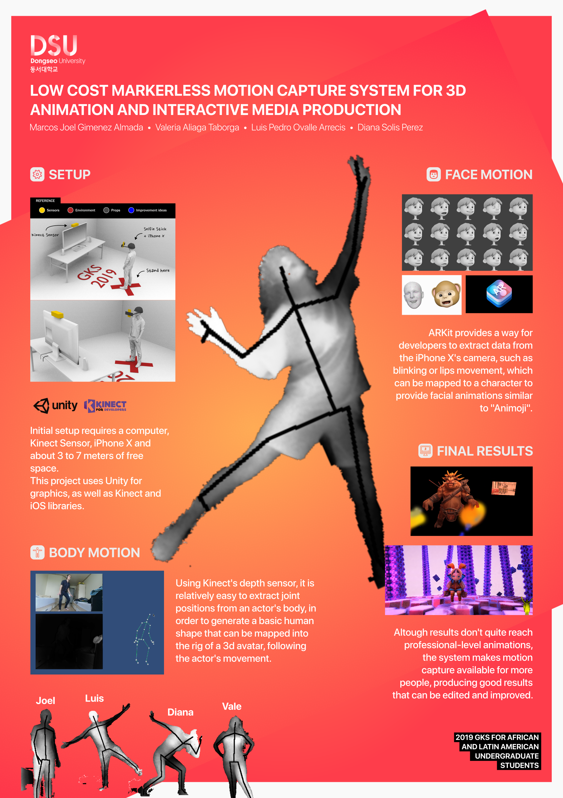

LOW COST MARKERLESS MOTION CAPTURE SYSTEM 
============
## 2019 GKS for Latin American Undergraduate Students

This is final project developed for Image Processing class of the 2019 GKS for Latin American Undergraduate Students program,
at Dongseo University. It is basically a bunch of copied, pasted and modified code to show a little demo of how
kinect might be used to capture motion for animation.
The original project with the base assets is somewhere around Github, credits to the original creator.
Also credits to my team at Dongseo University.

#### This project is a mess and is uploaded only for backup purposes.

## Poster
  

